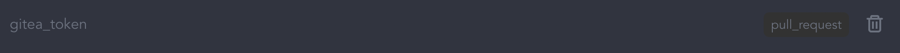
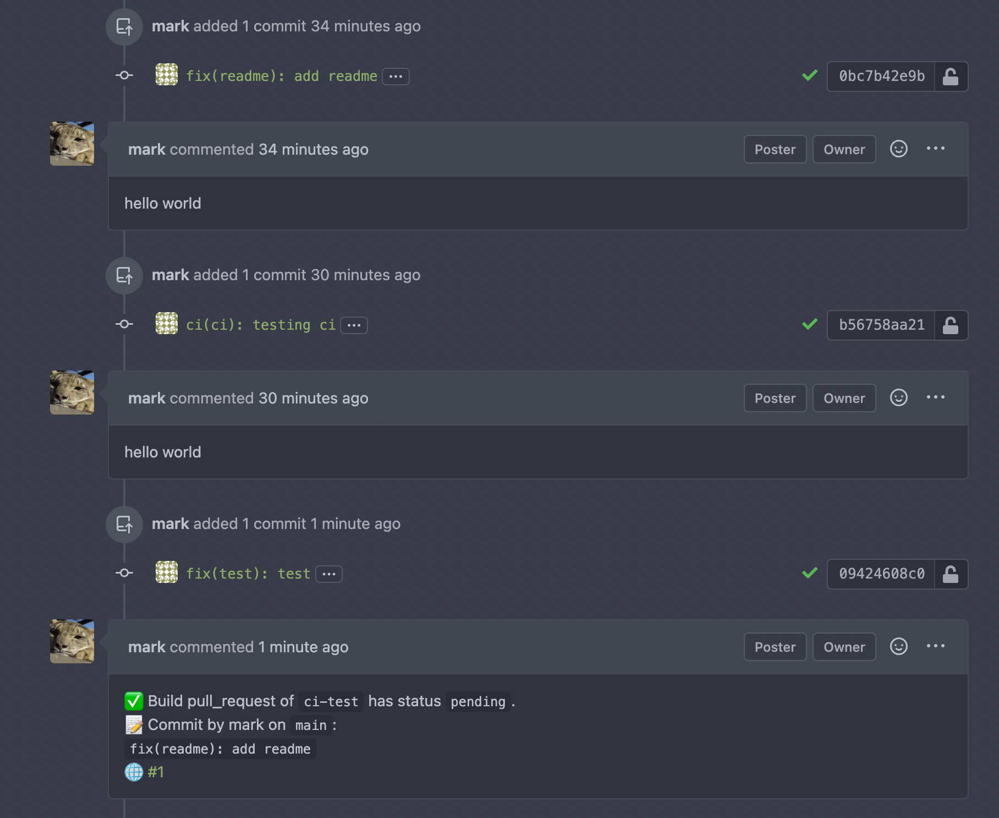

# gitea-pull-request-comment-plugin

A Woodpecker plugin to post comments onto a Gitea Pull Requests.

Note this currently only works on `pull request` events.

You'll need to generate a [Gitea API token](https://docs.gitea.io/en-us/api-usage/) before
you can use this.

## Usage/Examples

This example uses a woodpecker secret to pass the gitea API token to the pipeline
job. The secret is enabled for use on `pull requests` .



```yaml
pipeline:
  comment:
    image: mcs94/gitea-comment
    settings:
      gitea_address: https://gitea.url.goes.here
      gitea_token:
        from_secret: gitea_token
      comment: >
        ✅ Build ${CI_BUILD_EVENT} of `${CI_REPO_NAME}` has status `${CI_BUILD_STATUS}`.

        📝 Commit by ${CI_COMMIT_AUTHOR} on `${CI_COMMIT_BRANCH}`:

        `${CI_COMMIT_MESSAGE}`

        🌐 ${CI_BUILD_LINK}
    when:
      event: [pull_request]
```

Produces something with looks like the screenshot below on pull requests:



## Authors

* [@markopolo123](https://www.github.com/markopolo123)

## Running just the container

```bash
docker run \
-e PLUGIN_COMMENT="test comment" \
-e PLUGIN_GITEA_TOKEN="tokenhere" \
-e PLUGIN_GITEA_ADDRESS="https://gitea.url.here" \
-e CI_REPO_OWNER="repoowner" \
-e CI_REPO_NAME="yourrepo" \
-e CI_COMMIT_PULL_REQUEST=8 \
test-gitea
```
